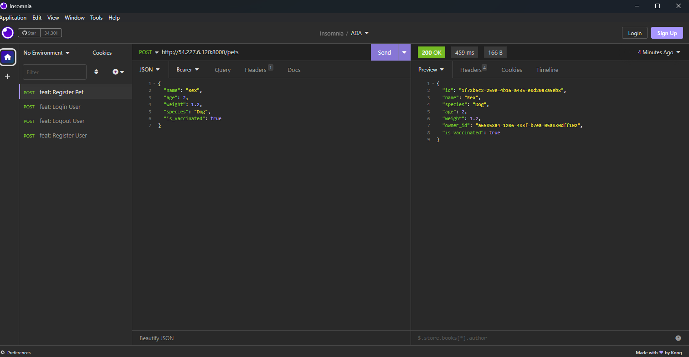
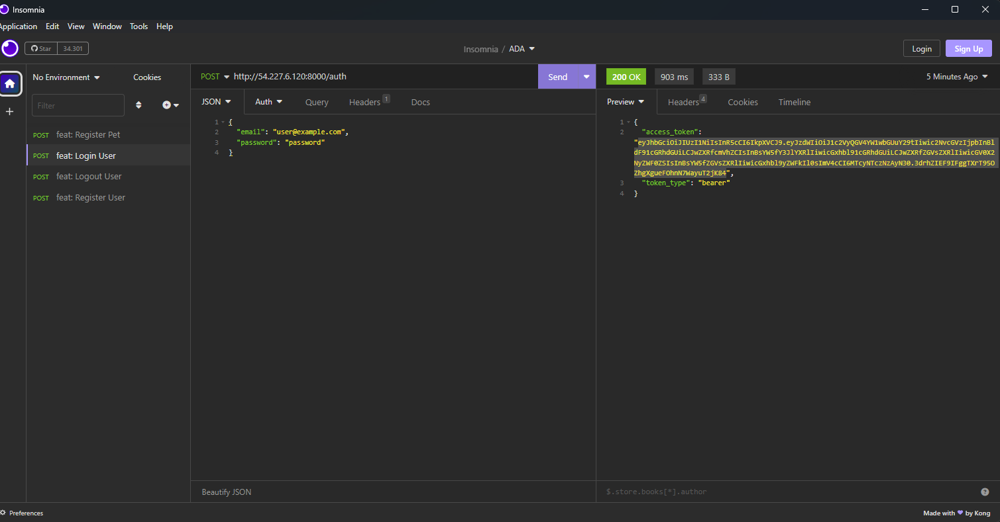
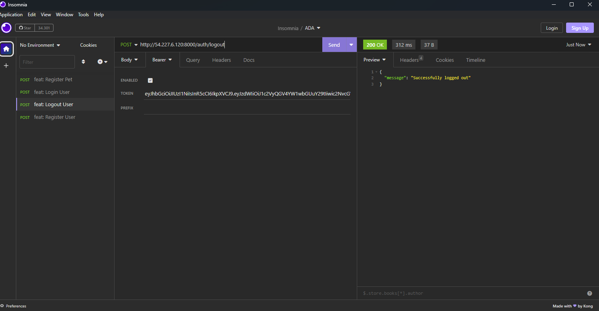

# Projeto API Pet ADA

## Sumário

Este projeto é uma aplicação desenvolvida em Python 3.10, projetada para treinar o desenvolvimento e a implementação de uma pipeline de deploy automatizada. A pipeline é acionada por pushes nas branches "develop" e "main", atualizando uma instância EC2 na AWS com as mudanças mais recentes.

## Arquitetura


## Resultado Final

- Algumas funcionalidades:









## Funcionalidades da aplicação API

- **Cadastro de Usuários**: Suporte para dois tipos de usuários - "cliente" e "admin".
- **Autenticação**: Logar e deslogar usuários.
- **Gerenciamento de Permissões**: 
  - Cadastrar grupos de permissões.
  - Definir regras (roles) e atribuí-las aos grupos de permissões.
- **Gestão de Planos de Pets**: 
  - Cadastro de planos, acessível apenas para usuários com permissões específicas.
  - Adicionar pets aos planos de acordo com a quantidade permitida.
- **CRUD de Pets**: 
  - Adicionar novos pets com detalhes como nome, raça, idade, peso e status de vacinação.
  - Gerenciar informações dos pets e planos.

## Tecnologias Utilizadas

- **Python**: Linguagem de programação utilizada para o desenvolvimento da aplicação.
- **FastAPI**: Framework web para construção da API.
- **Gunicorn**: Servidor HTTP WSGI para servir a aplicação.
- **AWS**: Plataforma de nuvem para hospedagem da aplicação.
- **GitHub Actions**: Ferramenta para automação da pipeline de deploy.

## Como Utilizar

### Pré-requisitos

- Python 3.10
- Pip
- Pipx
- Poetry
- Sqlite3

### Instalação

1. Clone o repositório:

    ```bash
    git clone git@github.com:Neto6391/versionamento_ada_mod02.git
    ```

2. Crie e ative um ambiente virtual:

    ```bash
    # Instale o Poetry
    python3.10 -m pip install --user poetry

    # Inicialize o ambiente virtual com Poetry
    poetry env use python3.10
    ```

3. Instale as dependências:

    ```bash
    # Instale o uvicorn
    poetry run pip install uvicorn

    # Instale as dependências do projeto
    poetry install --no-interaction --no-root
    ```

4. Aplique as migrações no banco de dados SQLite:

    ```bash
    poetry run alembic upgrade head
    ```

5. Inicie a aplicação:

    ```bash
    poetry run gunicorn app.main:app -w 4 -k uvicorn.workers.UvicornWorker -b 0.0.0.0:8000
    ```

6. Acesse a API no navegador ou cliente de testes de API:

    ```bash
    http://localhost:8000/
    ```

## Implantação na AWS Usando GitHub Actions

1. Crie uma conta na AWS e configure o acesso programático.
2. Lance uma instância EC2, gere uma chave SSH e mantenha-a em um local seguro.
3. Configure um Security Group para a EC2 com portas 22 e 8000 abertas.
4. Adicione os segredos necessários nas variáveis do GitHub Actions, na aba "Settings" do repositório, com as seguintes chaves:
   - `EC2_SSH_KEY`
   - `EC2_PUBLIC_IP`
5. Faça um push na branch "main" para acionar a pipeline de deploy.
6. Acesse a aplicação na EC2:

    ```bash
    http://<EC2_PUBLIC_IP>:8000
    ```

## Observações

- Para evitar acionar o deploy em modificações não relacionadas, use os seguintes comandos de commit:

    ```bash
    git commit -m 'feat/nome_da_feature [skip actions]'
    ```

### Exemplos de Commits com Skip Actions

    ```bash
    git commit -m "feat: Update docs [skip ci]"
    git commit -m "fix: Fix typo [ci skip]"
    git commit -m "feat: Minor change [no ci]"
    git commit -m "feat: Change config [skip actions]"
    git commit -m "feat: Update dependencies [actions skip]"
    ```

### Boas Práticas

- Para evitar enviar arquivos desnecessários para o deploy, ajuste o fluxo do GitHub Actions:

    ```yaml
    on:
      push:
        branches:
          - main
        paths-ignore:
          - 'docs/**'
          - 'README.md'
    ```
## Licença

Este projeto está sob a licença do MIT. Consulte a [LICENSE](LICENSE) para obter mais informações.

## Como contribuir

1. Siga as diretivas do [CONTRIBUTING.md](docs/CONTRIBUTING.md) foi incluso instruções da execução do script **user_data_ec2** nas diretivas de contribuição.

## Autores

- [Neto Rodrigues](https://github.com/Neto6391)
